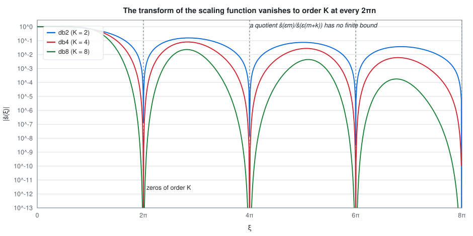
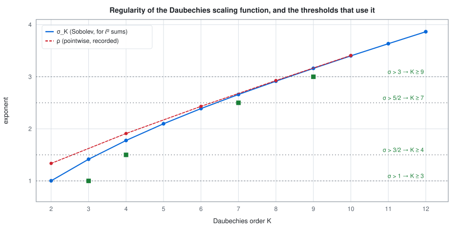
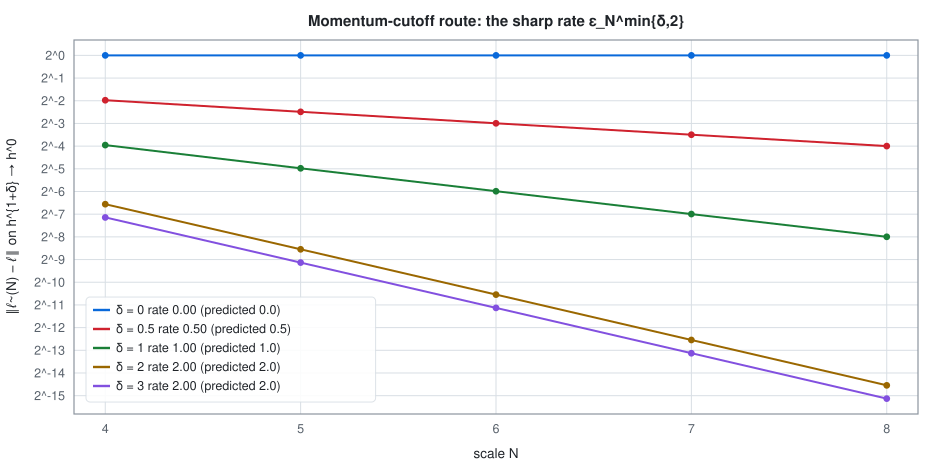
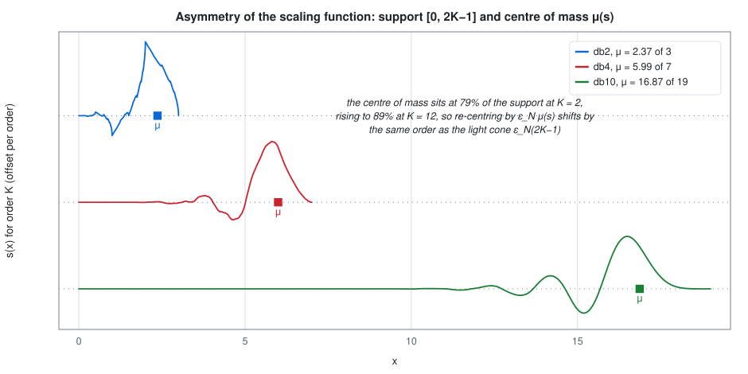
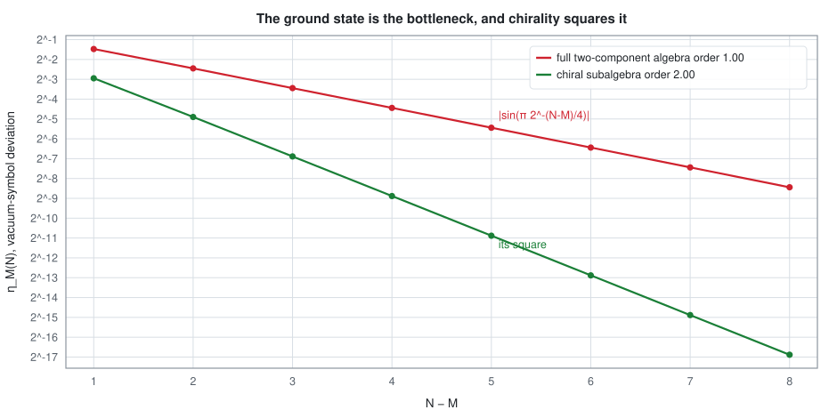
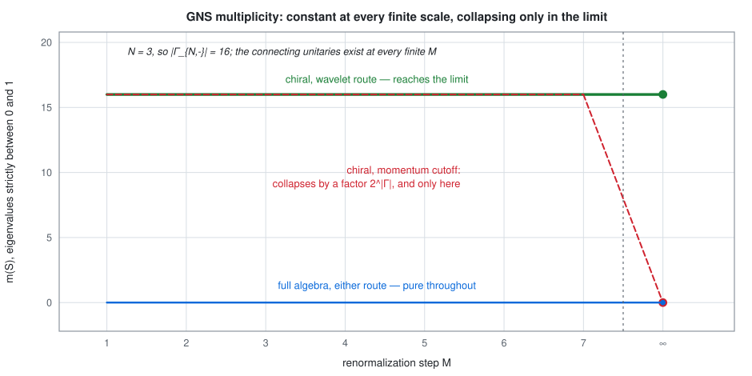

# Conformal field theory from lattice fermions — a critical re-reading and a revised manuscript

This repository holds an adversarial re-examination of the published article

> T. J. Osborne and A. Stottmeister, *Conformal Field Theory from Lattice Fermions*,
> Communications in Mathematical Physics **398** (2023) 219–289,
> [doi:10.1007/s00220-022-04521-8](https://doi.org/10.1007/s00220-022-04521-8),
> [arXiv:2107.13834](https://arxiv.org/abs/2107.13834), published open access under CC BY 4.0,

together with a revised version of that article in which every defect the re-examination found
is repaired, and a separate note settling one comparison the article makes in its introduction.

**The theorems of the published article stand.** No counterexample to any of them was found, and
no theorem statement has been changed. What the re-examination found is that several of the
published *proofs* do not establish what they claim, that the phrase "sufficiently regular" hides
three different and much larger thresholds than the folklore suggests, and that one normalisation,
read literally, would give the wrong central charge. All of this is repaired in the revision.

### Read it here

| | |
|---|---|
| **The revision**, 97 pp | [`docs/pdf/free_fermion_cft_v5.pdf`](docs/pdf/free_fermion_cft_v5.pdf) |
| **The audit** that prompted it, 8 pp | [`docs/pdf/critical-reread.pdf`](docs/pdf/critical-reread.pdf) |
| **The Zini–Wang note**, 9 pp | [`docs/pdf/zini-wang-comparison.pdf`](docs/pdf/zini-wang-comparison.pdf) |
| **Reference**: status, notation, definitions, every numbered statement | [`docs/reference/`](docs/reference/) |
| **Interactive companion**, a widget per result | [`docs/index.html`](docs/index.html), served from `docs/` |

The interactive page computes everything in your browser from the same Daubechies filters the
paper uses, and its last section checks that computation against the values produced with numpy.
It is not yet published; serve it locally with `python3 -m http.server` from `docs/`.

## What this is: an AI-assisted, experimental open-science project

This repository is an **experiment in open science, and the work in it is AI-assisted.** The
re-reading, the revision and the note were produced by the author working with Anthropic's Claude
as an interactive assistant, over three days in July 2026, and the working record — the list of
findings, the itemised changelog, the improvement plan and the numerical scripts behind every
number quoted — is published alongside the result rather than discarded.

**Human verification is ongoing.** Nothing in this repository has been refereed. Read every
statement here as a claim under active verification, not as a settled result, and check anything
you intend to rely on against the cited sources yourself. Direction, mathematical judgement and
final responsibility are the author's.

**Both authors have agreed to publication.** T. J. Osborne, co-author of the published article,
has agreed to this material being made public in this form. The revision names no reviser: it is
a revision of a paper by both of its authors, not a new work by a third party, and the changes it
makes are itemised in `CHANGES-v4-to-v5.md` rather than attributed on its title page.

## Relation to the published article — please read before citing

`free_fermion_cft_v5.tex` is **not the version of record** and must not be cited in its place.
The chain of versions is:

| version | what it is | public |
|---|---|---|
| arXiv v3, 24 Nov 2022 | last arXiv version, 71 pp | yes, CC BY 4.0 |
| CMP **398** (2023) 219–289 | version of record, 71 pp | yes, CC BY 4.0 |
| `free_fermion_cft_v4.tex` | the authors' own later draft, 72 pp as compiled here | **no** — first published in this repository |
| `free_fermion_cft_v5.tex` | the revision made here, 97 pp | this repository |

The middle step matters and is not documented anywhere else, so it is recorded here.
`free_fermion_cft_v4.tex` is a post-publication draft that was never released. It differs from
the arXiv v3 source in four places of content:

1. two typographical corrections in the second-quantisation formulas, `a†Aa → a†Ga` and
   `½Ψ*AΨ → ½Ψ*GΨ`;
2. the rescaled scaling function is **(anti)periodized**, `s^(ε_N) → s^(ε_N)_±` carrying a factor
   `(±1)^m`, with the scaling equation restated over all of `ℤ` and an added sentence explaining
   that in momentum space the (anti)periodization is the restriction of `ŝ` to `Γ_{N,±}`;
3. one rewritten sentence in the definition of the local one-particle spaces.

The version of record reads "2L-periodized" at point 2; the draft reads "2L-(anti)periodized".
One further difference against arXiv v3 is not the authors' but ours: the date `\today` was
replaced by the fixed date `21 June 2024`, that of the build this draft was taken from, so that the
file compiles reproducibly. Nothing else in it was touched.
The changelog `CHANGES-v4-to-v5.md` documents only the step from this draft to the revision, so
a reader comparing the revision against the published article will meet these four differences
in addition to everything the changelog lists. A `latexdiff` of the draft against the revision
does not show them either; the recipe for producing one is under **Building** below.

## What the results look like

Six figures, each regenerated from the filters by `tools/make_figures.py`. They are the six
claims it is hardest to believe from the prose alone.

**The step that is false.** Orthonormality forces the transform of the scaling function to vanish
to order K at every non-zero multiple of 2π. The published proof bounded a *quotient* of two of
its values by uniform continuity; put the denominator on a zero and no such bound exists.

<picture>
  <source media="(prefers-color-scheme: dark)" srcset="docs/figures/shat-zeros.dark.svg">
  
</picture>

**What "sufficiently regular" costs.** Four thresholds occur, needing Daubechies orders 3, 4, 7
and 9. The advertised rate is at δ = 2, which needs K ≥ 9, not the K ≥ 2 of folklore; the squares
mark the smallest order that supplies each threshold.

<picture>
  <source media="(prefers-color-scheme: dark)" srcset="docs/figures/regularity-ladder.dark.svg">
  
</picture>

**The sharp rate.** On the momentum-cutoff route the difference of approximant and generator is an
explicit multiplier, so its operator norm is a supremum one can evaluate. The rate is min{δ,2},
and the cap at 2 is real.

<picture>
  <source media="(prefers-color-scheme: dark)" srcset="docs/figures/momentum-cutoff-rates.dark.svg">
  
</picture>

**Why re-centring buys an order.** Daubechies scaling functions are markedly asymmetric: the
centre of mass sits at 79 to 89 per cent of the way along the support. Comparing against it rather
than against the lattice site removes a first-order error.

<picture>
  <source media="(prefers-color-scheme: dark)" srcset="docs/figures/scaling-function-support.dark.svg">
  
</picture>

**Where the simulation cost comes from.** The bottleneck is the ground state, not the dynamics.
Its error is first order on the full two-component algebra and second order on a chiral
subalgebra, and that squaring is a square root in the qubit count.

<picture>
  <source media="(prefers-color-scheme: dark)" srcset="docs/figures/simulation-budget.dark.svg">
  
</picture>

**What the connecting unitaries really require.** Not purity, but constancy of the GNS
multiplicity. It is constant at every finite step and collapses only in the limit, and only along
the momentum-cutoff route.

<picture>
  <source media="(prefers-color-scheme: dark)" srcset="docs/figures/multiplicity.dark.svg">
  
</picture>

## Contents

| file | what it is |
|---|---|
| `critical-reread.tex` | 8 pp, 29 July 2026. The eight findings, with numerical evidence for each. Numbering is that of the published article. |
| `free_fermion_cft_v5.tex` | 97 pp. The revision. Carries a note on its title page saying what it is. |
| `free_fermion_cft_v4.tex` | the unreleased draft the revision starts from. |
| `CHANGES-v4-to-v5.md` | every change from the draft to the revision, itemised, with a v4↔v5 numbering table. |
| `IMPROVEMENT-PLAN.md` | the fourteen improvements made after the eight findings were repaired, in three tiers, all carried out. |
| `zini-wang-comparison.tex` | 9 pp, 31 July 2026. A note making §1.2's comparison with the low-energy scaling limit of Zini and Wang precise. |
| `numerics/` | nineteen `numpy` scripts. Every number quoted in the documents comes from one of them. |
| `sync_docs.py` | regenerates the parts of the two Markdown files, and `mainrefs.tex`, that carry statement numbers. |
| `docs/` | the site root: the interactive page, the reference folder, the figures, the three PDFs, and the JSON they are built from. |
| `docs/reference/` | status, notation, definitions, and a generated index of all 68 numbered statements. |
| `tools/` | the generators and the checks: filters, the SVG plotter, the figures, the reference index, the reproducible PDF build, and two scripts that verify the browser against the Python. |

### The eight findings

Numbers below are those of the **published** article.

| # | where | what | severity |
|---|---|---|---|
| 1 | Lemma 4.5 | the dominating function is obtained by bounding a quotient of `ŝ` by continuity; `ŝ` has zeros of order `K` at `2πℤ∖{0}`, so no such bound exists | gap, repairable |
| 2 | (204)–(210) | consequently `Error²(δ,L,k,N) = +∞` for every `k ≠ 0` in the Ramond sector, and the advertised rate is established only for `k = 0` | not established |
| 3 | "sufficiently regular" | three distinct thresholds, none stated: `σ_K > 1`, `σ_K > 3/2`, `σ_K > 1+δ`. The advertised `δ = 2` rate needs `K ≥ 9`, not `K ≥ 2` | hypothesis gap |
| 4 | Remark 4.14 | the Hardy projections do not preserve the wavelet core, so the claim does not follow from Lemma 4.5 | gap, repairable |
| 5 | Definition 4.2 | the one-particle generator is off by `L/π` against (165)/(167); read literally, (170) gives `c = (L/π)²` | normalisation |
| 6 | Theorem 6.3 | the two decisive ingredients are asserted, not proved; one is an `N`-uniform energy bound, a theorem in its own right | rigor debt |
| 7 | Theorem 4.16 | the preamble's locality claim is not established: that algebra is transported by the momentum-cutoff maps | overstatement |
| 8 | (25), Lemma 3.7, (204)/(205), (213) | typographical and constant errors | cosmetic |

All eight are repaired in the revision; §§1–7 of `CHANGES-v4-to-v5.md` say how. Finding 6 is
repaired by proving the energy bound, so Theorem 6.3 of the published article, Theorem 6.5 of the
revision, is now unconditional.

## Status and open points

- **The disposition of the revision is not settled.** Whether it becomes a corrigendum, an arXiv
  replacement or a separate follow-up paper has not been decided.
- **Nothing here has been refereed.**
- Three constants in the revision are known to be sufficient but not sharp: the growth constant of
  Remark 4.13, the aliasing exponent of Lemma 4.28, and the bound `σ_K ≥ K − 𝒦 − ½` of
  Definition 3.12. The revision says so at each place.
- The Zini–Wang note settles the comparison at fixed finite `N` for quasi-free states. Its §8
  lists four things it does not settle, among them the passage `N → ∞`, which needs quasi-equivalence
  rather than a multiplicity count.
- An earlier version of `critical-reread.tex` offered a one-line repair of the analytic-vector
  claim in Finding 6. That repair was itself wrong, for the reason now given in the text; the
  correct route is Nelson's commutator theorem, and it is what the revision uses.

## Building

Everything is regenerable, and the committed output is byte-reproducible from a clean checkout.
Python, `numpy` and a TeX installation are the only requirements; `node` is needed only for the
two checks that exercise the browser code.

**The documents.** Three are tracked as PDFs under `docs/pdf/`, a deliberate exception to the
policy that keeps build output out of git, so that the links above resolve and a clone is
self-contained. Rebuild them with

```sh
sh tools/build_pdfs.sh          # fixes SOURCE_DATE_EPOCH; output is byte-identical to what is committed
```

or compile any one by hand, twice, for cross-references:

```sh
mkdir -p build
pdflatex -output-directory=build free_fermion_cft_v5.tex
python3 sync_docs.py            # after any recompile of the revision
```

`sync_docs.py` reads `build/free_fermion_cft_v5.aux`, so the revision must be compiled first. It
regenerates `mainrefs.tex`, which the Zini–Wang note inputs, and the parts of the two Markdown
records that quote statement numbers. Every source carries a fixed date rather than `\today`,
which is the other half of reproducibility.

**The marked-up comparison** of the draft against the revision is generated, not tracked:

```sh
latexdiff free_fermion_cft_v4.tex free_fermion_cft_v5.tex > diff_v4_v5.tex
pdflatex -output-directory=build diff_v4_v5.tex            # twice; about 102 pp
```

It carries one unresolved cross-reference, to an equation label the revision deletes. That is an
artifact of `latexdiff`, which strips labels out of deleted text while still typesetting the text
itself; both sources compile with no undefined references.

**The figures, data and reference index.** In this order, because each reads what the last wrote:

```sh
python3 tools/make_data.py       # docs/data/filters.json and recorded.json
python3 tools/make_figures.py    # the twelve SVGs, two themes each
python3 tools/build_reference.py # docs/reference/results.md, from the compiled .aux
```

`build_reference.py` marks which statements are new in the revision by comparing the two
auxiliary files, so compile `free_fermion_cft_v4.tex` as well if you want that column.

**The site.** No build step and no third-party script. Serve it and open the page:

```sh
cd docs && python3 -m http.server
```

**The checks.** The numerical scripts need `numpy` and nothing else:

```sh
python3 numerics/os_check4.py      # Daubechies filters and Sobolev exponents, K = 2..12
python3 tools/dbfilters.py         # the filter self-test
node tools/check_js.mjs            # the browser kernels against the numpy values
node tools/check_widgets.mjs       # every widget across its entire control range
```

The filters are constructed from scratch by spectral factorisation; orthonormality holds to better
than `6·10⁻¹⁵` and the measured Sobolev exponents reproduce the literature values to three or four
digits. The self-test also pins the two conventions that are easy to get wrong, which are set out
in [`docs/reference/notation.md`](docs/reference/notation.md).

## Licence

- **Documents** (`*.tex`, `*.md`): [CC BY 4.0](LICENSE), the licence of the article they revise.
  The published article is © the authors, 2022, CC BY 4.0; this revision is a derivative work, and
  the modifications are indicated on the title page of the revision and itemised in
  `CHANGES-v4-to-v5.md`, as that licence requires.
- **Code** (`numerics/`, `sync_docs.py`): [MIT](LICENSE-CODE).

No third-party copyrighted material is contained in this repository or in its history.

## Citing

Cite the published article for the results it contains. If you refer to something that exists only
here — a finding, a rate, the energy bound, the multiplicity criterion — cite this repository by
URL and commit, and say that it has not been refereed. `CITATION.cff` carries the metadata.
